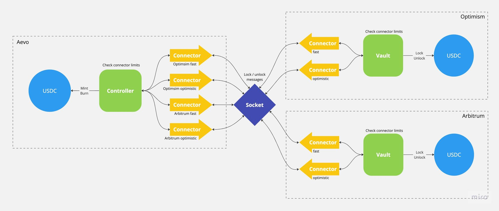

### Gauge

- Abstract contract used to implement rate limits.

### ConnectorPlugs

- Vault and Controller connect to socket via ConnectorPlugs
- This is to enable support of multiple switchboards on same path.

### Vault

- Contract on non App chains.
- Lock and unlock amounts.
- Implements Gauge.
  - Revert on lock throttle.
  - Store pending and unlock later on unlock throttle.

### Controller

- Contract on App chain.
- Has mint and burn rights on token.
- Calls ExchangeRate contract for lock >> mint and burn >> unlock conversion.
- Implements sibling chain specific Gauge.
  - Revert on burn throttle.
  - Store pending and mint later on mint throttle.

### ExchangeRate

- Contract for lock >> mint and burn >> unlock conversion.
- Enables path to AMM based bridging.

## Throttling

- Each connector has a configurable `maxLimit` and `ratePerSecond`.
- `maxLimit` defines the maximum amount that can be bridged in the decided time frame.
- `ratePerSecond` defines the rate at which limit is replenished once it is used. The limit keeps increasing with time till it reaches `maxLimit`.
- Eg. Suppose we want to allow maximum 3600 tokens to be deposited per hour.
  - `maxLimit = 3600`
  - `ratePerSecond = maxLimit / duration = 1`
  - If a user were to deposit 3600 tokens, no one would be able to deposit more tokens immediately.
    After 10 minutes, users would be able to deposit `10 * 60 * 1 = 600` tokens.
    After an hour, they would be able to deposit `60 * 60 * 1 = 3600` tokens.
  - If a user were to deposit 1200 tokens, users could deposit `3600 - 1200 = 2400` more tokens immediately.
    And after 10 minutes they would be able to deposit `2400 + 10 * 60 * 1 = 3000` tokens.
